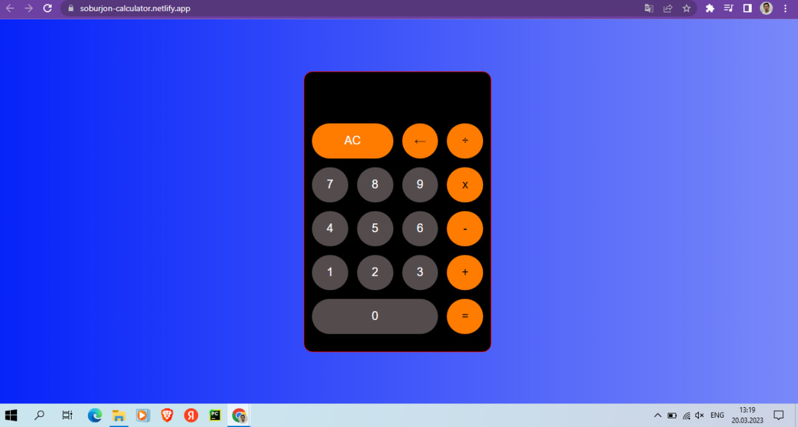

<h2 align="center">
  <a href="https://soburjon-calculator.netlify.app/" target="_blank">Calculator</a>
</h2>

  

## 🛠 Installation and Setup Instructions

1. Installation: `npm i or npm install`

2. In the project directory, you can run: `npm start`

Runs the app in the development mode.\
Open [http://localhost:3000](http://localhost:3000) to view it in the browser.
The page will reload if you make edits.

## Usage Instructions

Open the project folder and Navigate to `/src/components/`.  
You will find all the components used and you can edit your information accordingly.

### Show your support

Give a ⭐ if you like this website!

